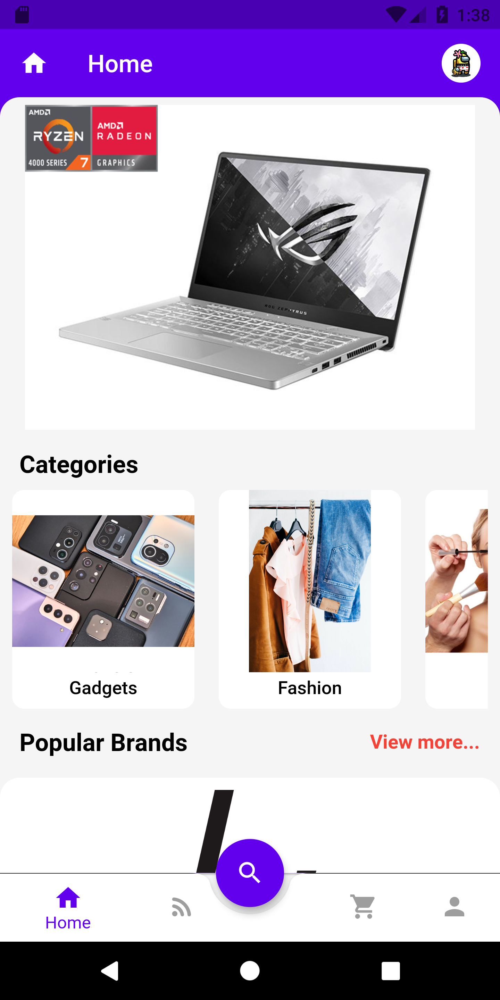
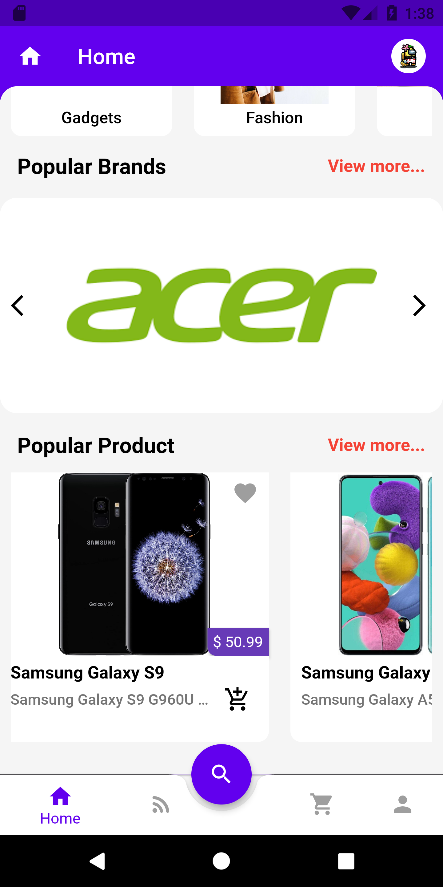
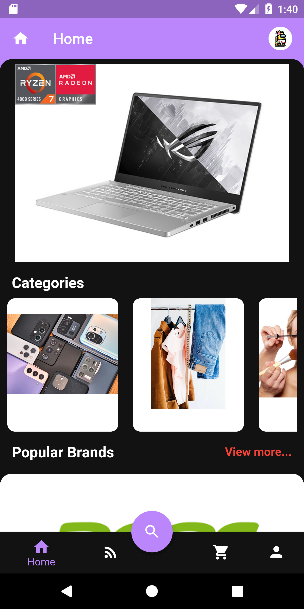
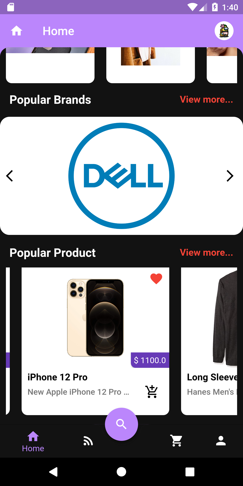
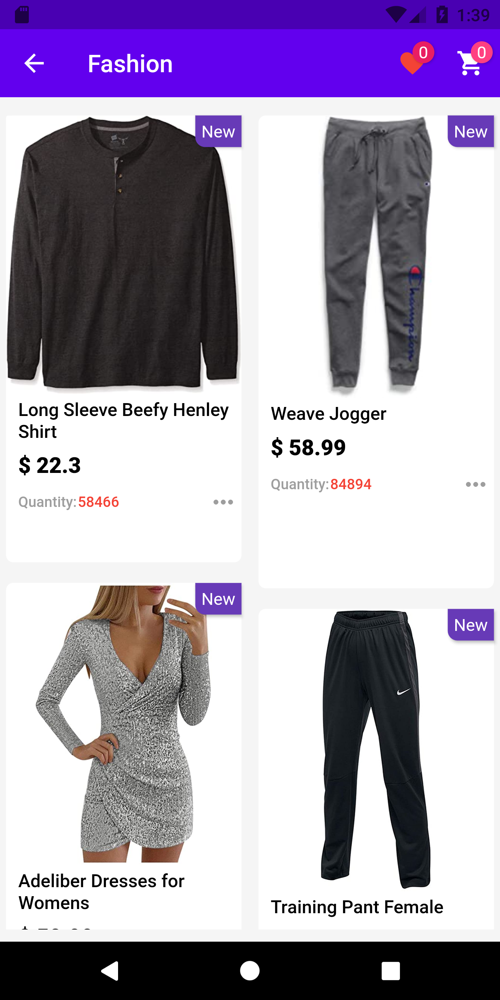
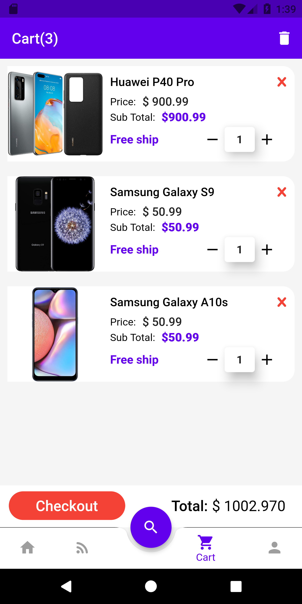
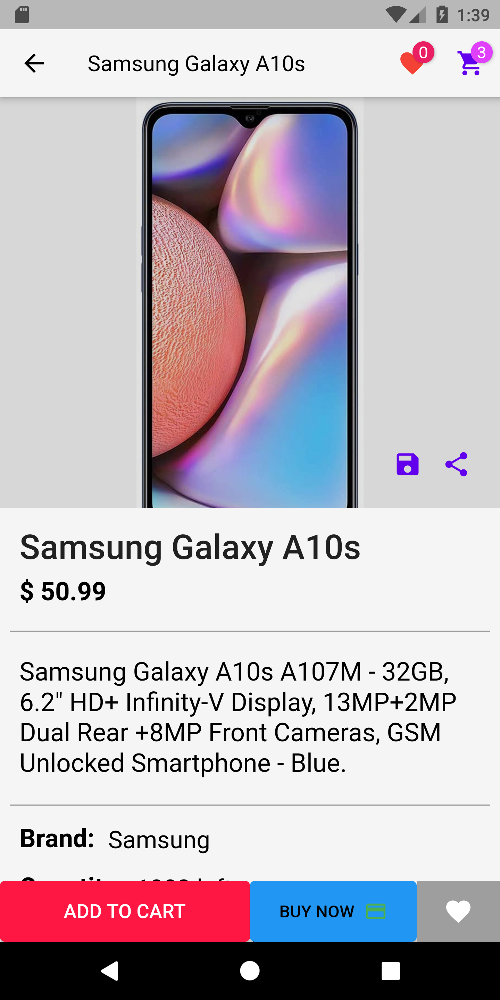
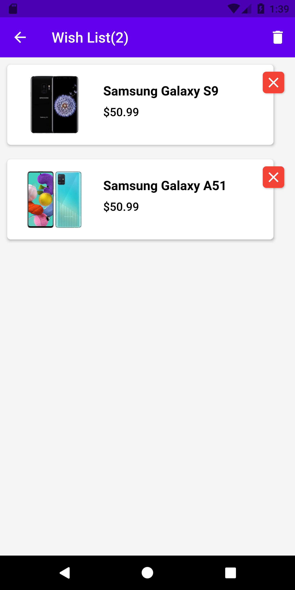
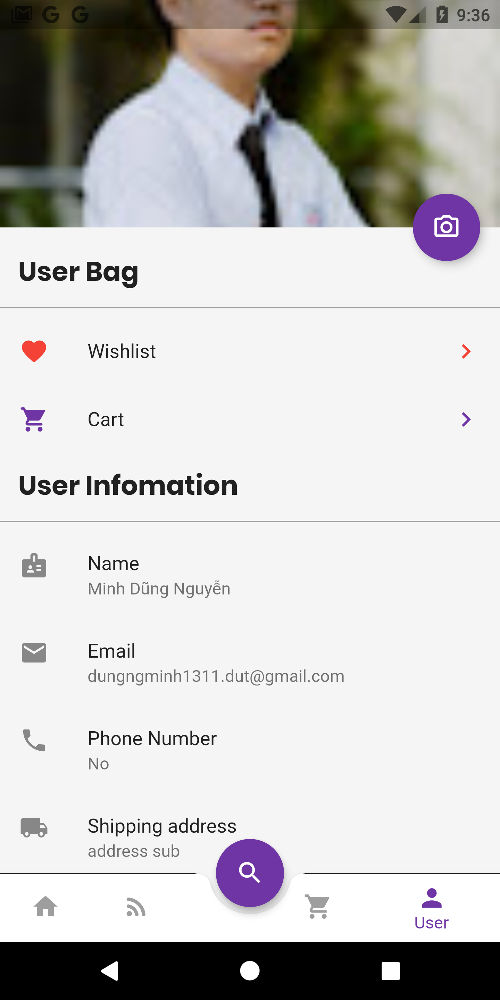

# Ecommerce App

A ecommerce app using Flutter, Firebase for backend and Stripe for payment module

In development (The project was delayed from July 26 due to exam preparation reasons)

## Features

- Flutter using Provider for state management
- Firebase authentication, Firestore, Firebase Storage
- Stripe package in payment module

## Directory structure

```
project
│   README.md
│
└───assets
│
│
└───lib
│   └───screens                 <- [UI]
│   │   │   ...
│   │   │   ...
│   │
│   └───models                  <- [Model]
│   |    │   ...
│   |    │   ...
│   |
|   └───provider                <- [Provider]
│   |    │   ...
│   |    │   ...
│   |
|   └───services                <- [Service]
│   |    │   firebase_authentication <- [for auth module]
│   |    │   firebase_storage  <- [for storing images]
|   │    |   firebase_firestore <- [for storing information]
│   |
|   └───ultis                   <- [Support fille (theme, setting,..]
│   |    │   ...
│   |    │   ...
│   |
|   └───widget                  <-[reused widget]
│   |    │   ...
│   |    │   ...
│   |
└───screenshots
    |    │   ...
    |    │   ...
    │   ...
```

## Screenshots

### (update to 26/7/2021, some new photos will be updated later, sorry for not fully updated)

|                                 |                                  |
| :-----------------------------: | :------------------------------: |
|       |       |
|  |  |
|   |   |
|    |    |
|        |       |
|    |         |

## Contributors ✨

<table>
  <tr>
    <td align="center"><a> <br /><sub><b>Nguyễn Minh Dũng</b></sub></a><br /><a href="https://github.com/dungngminh/ecommerce/commits?author=dungngminh" title="Code">💻</a> <a href="https://github.com/dungngminh/ecommerce/commits?author=dungngminh" title="Documentation">📖</a> <a 
  </tr>
</table>
